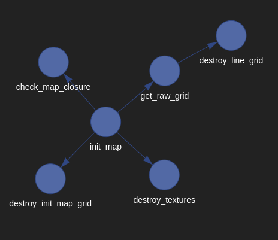
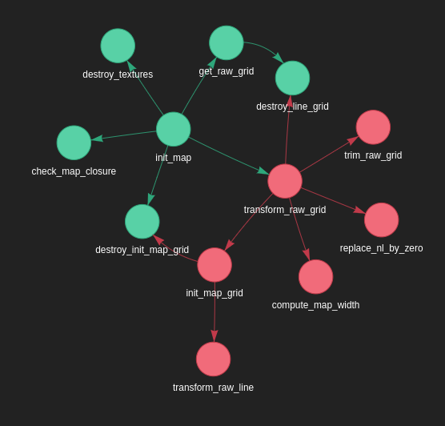

# Functions Network
## Description
Functions Network is a script that allows you to visualize the link between every functions of a C project. The better use of this script is to use it on a project norm with the 42 Norm.
## Installation
```bash
apt-get install python3
pip install -r requirements.txt
```
## Usage
```bash
python funtions_network.py <path to files or directories> ...
```
## Example
```bash
python funtions_network.py file1.c file2.c
```


```bash
python funtions_network.py dir/
```

## Credits
This script use the following librarie:
- [pyvis](https://pyvis.readthedocs.io/en/latest/)

Created by Valentin Lepiller as side projectof the 42 school.
Feel free to use it! :)